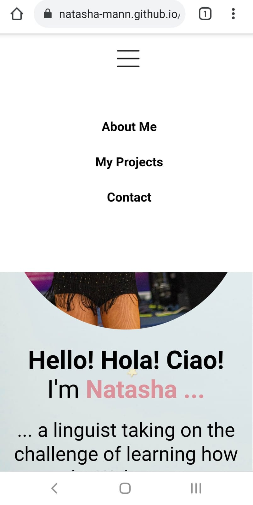

<h1 align=center> Personal Portfolio | Natasha Mann </h1>

<h2> Table of Contents </h2>

- [Project Link](#project-link)
- [About the Project](#about-the-project)
- [Plans for Improvement](#plans-for-improvement)
- [Screenshots](#screenshots)
  - [Full page screen capture of deployed site on laptop](#full-page-screen-capture-of-deployed-site-on-laptop)
  - [Screenshot examples of navbar on mobile device](#screenshot-examples-of-navbar-on-mobile-device)

## Project Link

Click [here](https://natasha-mann.github.io/portfolio-page/) to view the project on GitHub pages.

## About the Project

This project is my personal portfolio and features examples of my GitHub projects. The project was built fully with HTML and CSS.

The portfolio includes the following sections:

- About Me
- Projects
- Contact

The page is fully responsive and includes some accessibility features (eg. alt attributes).

I implemented some animations on the title page and some :hover pseudo classes in the CSS to elevate the page.

I also decided to add a hidden navbar element for mobile users, utilizing the animations in CSS along with pseudo-classes to apply certain CSS properties when a box is selected. This could be further improved in the future with Javascript, as noted below.

## Plans for Improvement

In the future I would like to develop the page further, to include some Javascript and other advanced CSS features. Primarily, I would aim to implement the following features:

- A "scroll-snap" feature on desktop to lock the viewport to each new section once the user has finished scrolling.
- An "internationalization" feature to allow the user to switch the site to their preferred language.
- A "dark-mode" element
- An improved hidden navbar for mobile users which drops down from the top when a button is clicked, and retracts when the user selects a menu item.

## Screenshots

### Full page screen capture of deployed site on laptop

### Screenshot examples of navbar on mobile device

