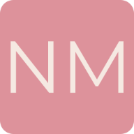
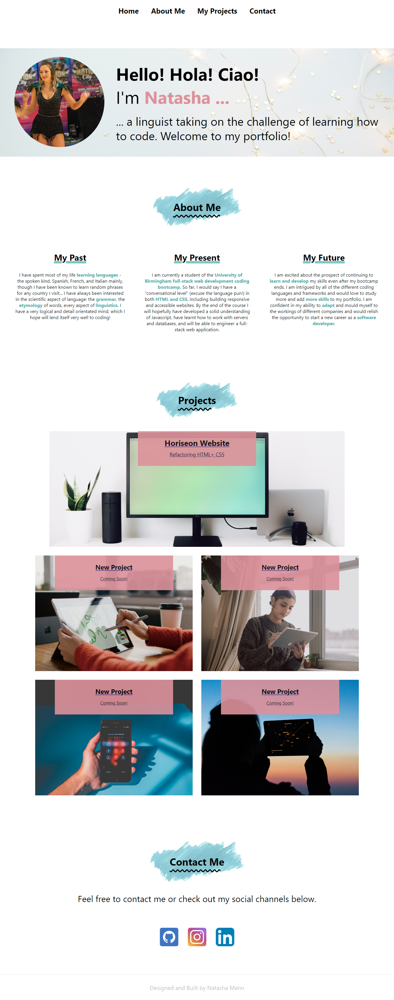
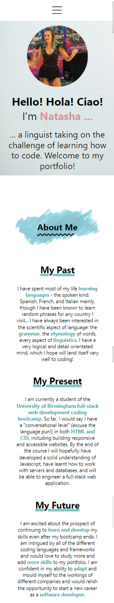
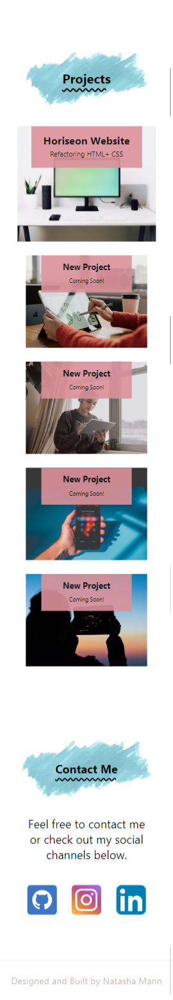
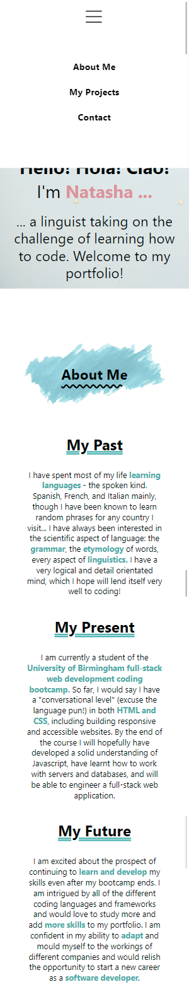
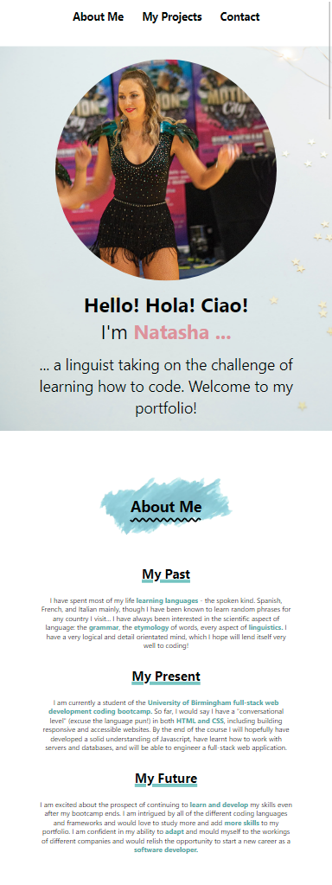
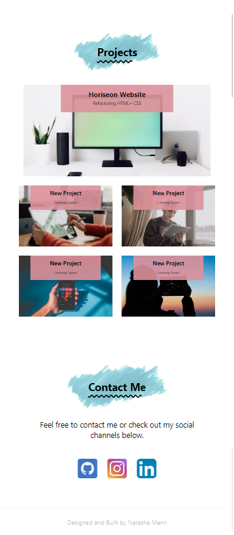

<h1>Personal Portfolio | Natasha Mann</h1>

<h2> Table of Contents </h2>

- [Project Link](#project-link)
- [About the Project](#about-the-project)
  - [Features](#features)
- [Plans for Improvement](#plans-for-improvement)
- [Screenshots](#screenshots)
  - [Desktop/laptop](#desktoplaptop)
  - [Mobile (menu closed and open)](#mobile-menu-closed-and-open)
  - [Tablet View](#tablet-view)

## Project Link

Click [here](https://natasha-mann.github.io/portfolio-page/) to view the project on GitHub pages.

## About the Project

This project is my personal portfolio and features examples of my GitHub projects. The project was completed during week 2 of my Coding Bootcamp and the brief was to create a working portfolio which was fully responsive, used flex containers, media queries and CSS variables.

The portfolio includes the following sections:

- About Me
- Projects
- Contact

### Features

- The page is fully responsive for all screen sizes
- It includes some accessibility features (eg. alt attributes).
- Animations on image and text on title page
- Nav links change colour and size when hovered over.
- Project images change size when hovered over.
- Project images are linked to deployed project pages.
- Hidden navbar element for mobile users, utilizing the animations in CSS along with pseudo-classes to apply certain CSS properties when a box is selected. This could be further improved in the future with Javascript, as noted below.

## Plans for Improvement

In the future I would like to develop the page further, to include some Javascript and other advanced CSS features. Primarily, I would aim to implement the following features:

- A "scroll-snap" feature on desktop to lock the viewport to each new section once the user has finished scrolling.
- An "internationalization" feature to allow the user to switch the site to their preferred language.
- A "dark-mode" element
- An improved hidden navbar for mobile users which drops down from the top when a button is clicked, and retracts when the user selects a menu item.

## Screenshots

### Desktop/laptop

### Mobile (menu closed and open)

  
   
  

### Tablet View

 
 

